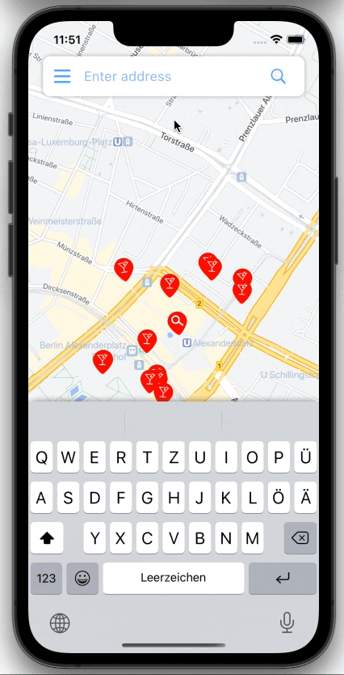

# VisitPlaces - Maps SDK for iOS

## Geocoding API + Place Autocomplete

## Places SDK for iOS

## JSON style
JSON map style changes when switching between dark and light modes

## Before running the application
Register for an API Key and paste into the app
